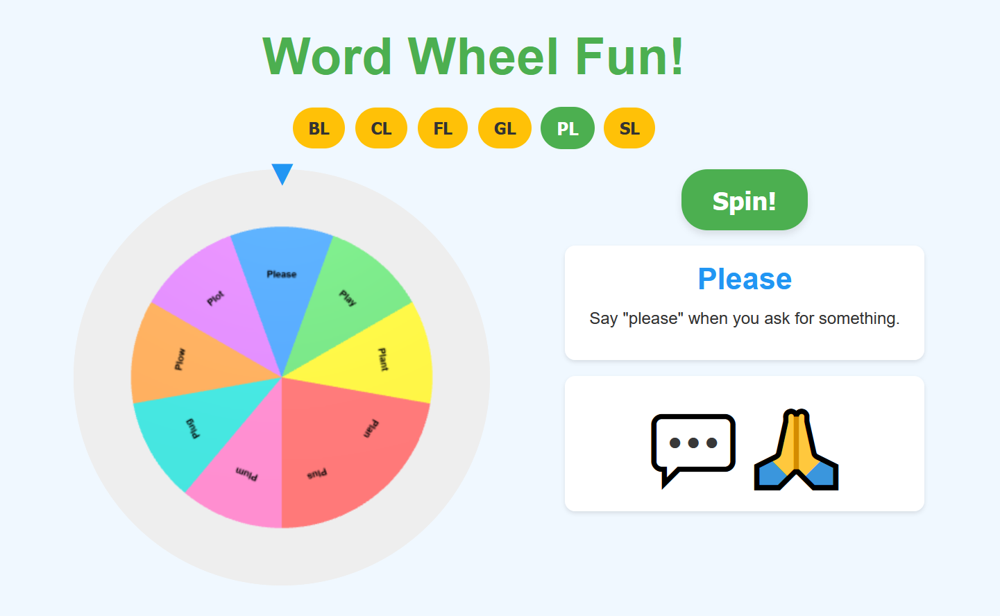

# Word Wheel Fun! - Interactive Speech Therapy Game



Try it here: (https://switchfire6.github.io/WordWheel/)

## Overview

Word Wheel Fun! is a web-based interactive "Wheel of Fortune" style game designed for speech therapy sessions with children. It aims to make practicing word blends a fun and engaging experience. The application is a single HTML page that utilizes modern web technologies to deliver a smooth and visually appealing game.

This tool was created with the guidance of a speech-language pathologist to assist children in their speech development journey.

## Purpose

The primary goal of this game is to provide a playful and interactive method for children to practice specific phonetic sounds, particularly starting letter blends (e.g., "sl," "bl," "cl"). It is intended to be used under the supervision of a speech-language pathologist or a guardian.

## Features

*   **Interactive 3D Wheel:** A colorful, spinning "Wheel of Fortune" style wheel rendered with Three.js.
*   **Filterable Word Categories:** Users can select specific letter blends (e.g., "sl", "bl") to focus on. The wheel dynamically updates with words from that category.
*   **Random Word Selection:** The wheel randomly selects up to 10 words from the chosen category to display, ensuring variety.
*   **Engaging Animations:** Smooth spin animations, button press feedback, and visual transitions powered by Anime.js.
*   **Clear Word Display:** When the wheel stops, the selected word and an example sentence are prominently displayed.
*   **Fun Visualizations:** A simple, kid-friendly visual representation (emoji or SVG icon) associated with the selected word appears.
*   **Responsive Design:** The layout adapts to various screen sizes, making it suitable for tablets and desktops.
*   **Kid-Friendly Aesthetics:** Bright colors, clear fonts, and an intuitive interface.

## Technologies Used

*   **HTML5:** For the basic structure of the game.
*   **CSS3:** For modern styling and layout.
*   **JavaScript (ES6+):** For game logic, interactivity, and DOM manipulation.
*   **Three.js:** For rendering the 3D spinning wheel.
*   **Anime.js:** For all animations (button clicks, wheel spin, visual transitions).
*   **JSON:** For storing and managing the word list (`words.json`).

## How to Play

1.  **Select a Blend:** Click on one of the filter buttons at the top (e.g., "SL", "BL", "CL") to choose a category of words. The wheel will update with words from that blend.
2.  **Spin the Wheel:** Click the large "Spin!" button. The wheel will spin and then slow down to land on a random word.
3.  **Practice the Word:**
    *   The selected **Word** will be displayed in large text.
    *   An **Example Sentence** using the word will be shown below it.
    *   A fun **Visualization** (an emoji or simple icon) related to the word will appear.
4.  **Repeat:** Select another blend or spin again for a new word from the current category!

## Setup Instructions (For Local Use or Development)

To run this game locally on your computer:

1.  **Download Files:**
    *   Download the `index.html` file.
    *   Download the `words.json` file.
    *   Download the `screenshot.png` file (or save the screenshot you have with this name).
2.  **Organize Files:** Place all downloaded files (`index.html`, `words.json`, and `screenshot.png`) into the **same folder/directory** on your computer.
3.  **Open in Browser:** Open the `index.html` file using a modern web browser (like Chrome, Firefox, Edge, or Safari). The game should load and be ready to play.

## Customization

The list of words used in the game can be easily customized by editing the `words.json` file. Each word object in the JSON follows this structure:

```json
{
  "Word": "Example",
  "StartsWith": "ex",
  "Syllables": 3,
  "SimplePronunciation": "/ɪɡˈzæmpəl/",
  "ExampleSentence": "This is an example sentence.",
  "RhymesWith": "sample, trample",
  "ImageIdea": "A lightbulb or a checkmark"
}
